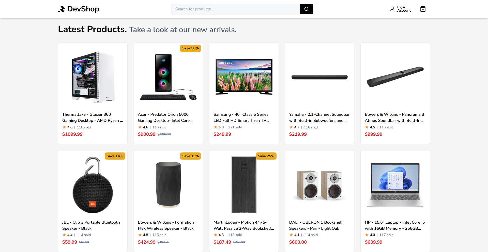

# [DevShop 🛍️](https://devshop-self.vercel.app)

Devshop is an online electric gadgets shopping website built with MERN stack.

[](https://devshop-self.vercel.app)

## Table of Contents

- [Tech Stack 🛠️](#tech-stack-🛠️)
- [Features 🚀](#features-🚀)
- [Running Locally 🧪](#running-locally-🧪)
  - [Prerequisites](#prerequisites)
  - [Steps](#steps)

## Tech Stack 🛠️

- **Frontend:** [React](https://react.dev/), [Redux](https://redux.js.org/), [TailwindCSS](https://tailwindcss.com/), [shadcn/ui](https://ui.shadcn.com/)
- **Backend:** [Node.js](https://nodejs.org/en), [Express.js](https://expressjs.com/)
- **Databases:** [MongoDB](https://www.mongodb.com/)
- **Payment**: [Stripe](https://stripe.com/)
- **Search engine**: [Elasticsearch](https://www.elastic.co/elasticsearch)
- **Meida API**: [Cloudinary](https://cloudinary.com/)
- **Deployment:** [AWS EC2](https://aws.amazon.com/ec2/), [GitHub Actions](https://github.com/features/actions), [Vercel](https://vercel.com/)

## Features 🚀

- Elasticsearch for fast product search
- Node.js REST API with service-oriented architecture.
- OAuth 2.0 for secure authorization
- Support for products with diverse variations
- Stripe for secure payment
- React lazy loading to optimize performance
- Cloudinary for media management
- Automated CI/CD deployments with GitHub Actions

## Running Locally 🧪

### Prerequisites

- [Node.js](https://nodejs.org/en)
- [Docker](https://www.docker.com/) (includes Docker Compose)
- [Google OAuth 2.0 credentials](https://developers.google.com/identity/protocols/oauth2#1.-obtain-oauth-2.0-credentials-from-the-dynamic_data.setvar.console_name-.) (Client ID)
- [Stripe](https://stripe.com/) (Publishable and Secret Keys)
- [Cloudinary](https://cloudinary.com/) (Name, API Key and API Secret)

### Steps

#### Step 1: Clone the Repository

Clone the BullFood repository to your local machine: bash Copy code

```bash
git clone https://github.com/devltt404/devshop
cd devshop
```

#### Step 2: Set Up the Client (Front-End)

1. Navigate to the `client` folder:

   ```bash
   cd client
   ```

2. Install Dependencies

   ```bash
   npm i
   ```

3. Setup env variables

   Copy the `.env.development.example` to `.env.development`.

   ```bash
   cp .env.development.example .env.development
   ```

> [!IMPORTANT]
> You must provide values for `VITE_STRIPE_PK` and `VITE_GOOGLE_CLIENT_ID`

#### Step 3: Set Up the Server (Back-End)

1. Navigate to the `server` folder:

   ```bash
   cd ../server
   ```

2. Install client dependencies

   ```bash
   npm i
   ```

3. Setup env variables

   Copy the `.env.development.example` to `.env.development` and update the variables.

   ```bash
   cp .env.development.example .env.development
   ```

> [!IMPORTANT]
> You must provide values for `CLOUDINARY_NAME`, `CLOUDINARY_API_KEY`, `CLOUDINARY_API_SECRET`, `STRIPE_PK` (publishable key) and `STRIPE_SK` (secret key)

#### Step 4: Set Up the Services with Docker Compose

We use **Docker Compose** to set up and run **MongoDB**, **Elasticsearch** and **Kibana** services locally.

1. Start services

   ```bash
   docker-compose up -d
   ```

2. Verify running Containers

   ```bash
   docker-compose ps
   ```

You should see the following services listed:

- **mongodb** on port `27018`
- **elasticsearch** on port `9200`
- **kibana** on port `5601`

#### Step 5: Set up Data

Import sample data to **MongoDB** and **elasticsearch**

```bash
npm run setup
```

#### Last Step: Run the Server

```bash
npm run dev
```

Access the website through your browser at: [http://localhost:5173](http://localhost:5173)
